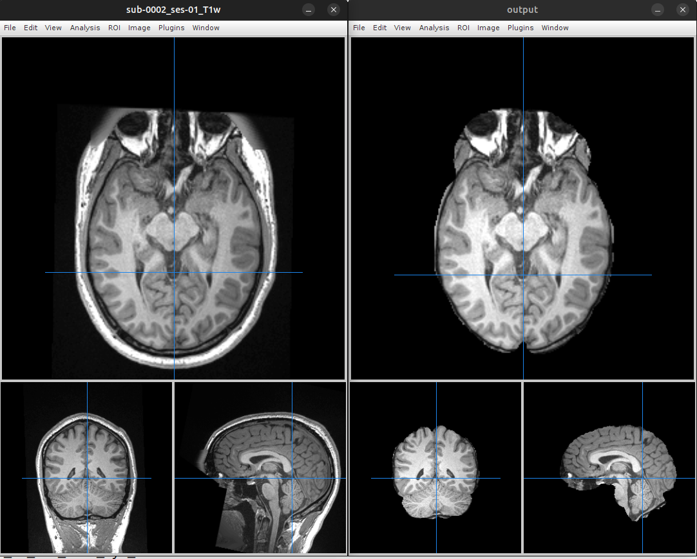
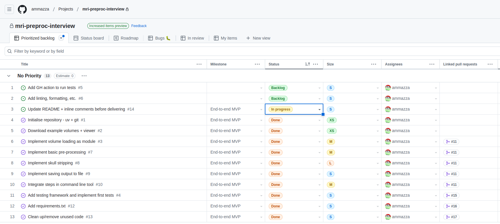

# mri-preproc

A library and CLI tool to preprocess T1-weighed head MRI scans 
in NIfTI format and extract the brain.

## Quickstart

This section will help you install and test-run `mri-preproc`.

### Installing atlas and example data

To function correctly `mri-preproc` needs some atlas data.
Complete the following steps to set up the machine running `mri-preproc`.

- In your home directory create a folder named `mri` (see below for configuration)
- Download the [ICBM 2009a Nonlinear Symmetric Atlas](http://www.bic.mni.mcgill.ca/~vfonov/icbm/2009/mni_icbm152_nlin_sym_09a_nifti.zip)
- Unzip the atlas data into `~/mri` so that the individual nifti files are in `~/mri` 

__Note on configuration:__ the atlas directory and file names are defined in [this config file](mri_preproc/brain_extract/config.py).
If you want to use a different atlas setup, adjust the atlas variables accordingly.

To try `mri-preproc` you will need a T1-weighted head scan in NIfTI format.
For the sake of example download [this MRI scan](https://s3.amazonaws.com/openneuro.org/ds000247/sub-0002/ses-01/anat/sub-0002_ses-01_T1w.nii.gz?versionId=71.XAnuxtjw6ITyFLSPZeH_lAayTeyvq)
in the `~/mri` folder created above.

### Installing dependencies with uv

`mri-preproc` was developed using `uv` to manage python versions and dependencies.
If you don't have `uv` already installed, please follow the instructions on
[the official GitHub repo](https://github.com/astral-sh/uv).

After you have `uv` installed, you can install `mri-preproc` dependencies and
create a virtual environment for it, by running the following command in the
repository root:

```bash
uv sync
```

### Installing dependencies with pip

If you cannot install `uv` a traditional `requirements.txt` (generated by `uv`)
is also provided. You'll need a fairly recent python version. `mri-preproc` was
developed and tested using python `v3.12` as specified in the file
[.python-version](.python-version) used by `uv`.

```bash
# Create a virtual environment for the dependencies
virtualenv -p python3 .venv

# Activate it
source .venv/bin/activate

# Use pip to install all dependencies from requirements.txt 
pip install -r requirements.txt
```

__Note:__ this approach hasn't been fully tested.

### Running mri-preproc

Once the necessary data and dependencies are installed, run the following
commands in the repository root:

```bash
# Activate the virtual environment with the correct python and libs 
source .venv/bin/activate

# Run mri-proc on the example MRI scan 
python -m mri_preproc.main --input ~/mri/sub-0002_ses-01_T1w.nii.gz --output ~/mri/output.nii.gz --sigma 2

# For help with mri-proc parameters invoke:
python -m mri_preproc.main --help
```

__Note__: a single run can take several minutes (because of the registration
step). When developing or experimenting set `com_only = True` in [this config file](mri_preproc/brain_extract/config.py).
That will limit registration to centre-of-mass alignment, which too low quality for any real-world use
but extremely fast.

### Running unit tests

The `mri-preproc` codebase has almost zero test coverage. A couple of tests
were implemented under `mri_preproc/common/preproc/tests` as examples. To run them use:

```bash
# Activate the virtual environment with the correct python and libs 
source .venv/bin/activate

# Run all mri-proc tests and show their individual outcomes
pytest -v mri_preproc
```

### Visualising results

You can visualise the results by opening the input and output images with a NIfTI viewer like
[Mango](https://mangoviewer.com/). Below is a screenshot of the comparison on the example scan.



## Design, development and caveats

This section is a sparse collections of information.

### Code structure

This is an overview of the different modules that make up the codebase.

```text
├── docs
├── mri_preproc
│   ├── brain_extract   --> Main logic, uses registration to map the brain mask and extract the brain
│   ├── common          --> Utils to load and pre-process NIfTIs
│   │   ├── tests       --> The only example tests provided are for module 'common'
│   ├── main.py         --> The application entry point, a command line script
│   └── registration    --> Image registration code
├── pyproject.toml
├── README.md
├── requirements.txt
└── uv.lock

```

### AI tools

I used ChatGPT to help me do stuff that I had forgotten how to do. I knew the general direction,
but it was easier to ask than peruse tons of documentation. The most relevant examples are marked
with comments starting with `# ChatGPT:`.

### Missing bits

Many things are missing or could be improved! A few are marked with `# TODO:` comments in the code.
A few others are listed here:

- Programmatic linting, formatting and static checks.
- Pretty much all testing. Examples are provided but coverage is zero.
- Input validation. We should check that we're loading the right type of image, with
  the right dimensions, (i.e. a 3D T1 and not an fMRI of some kind).
- Exception handling. There are a couple of cases where I'm avoiding the intentionally
  (e.g. avoid division by zero in normalisation) but I've pretty much left it all for later,
  including all potential IO errors.
- DICOM input. This could be done by converting NIfTIs to DICOM (e.g. with dcm2niix)
  or natively loading DICOMs and, for instance, use the ITK image representation internally.
- Bespoke classes. In a few places we could specify types and encapsulate behaviour
  by using dedicated classes, e.g. standardise the image format used internally. 
- Better documentation. A few functions have docstrings. More are needed and some tool
  to collect them into API docs for all modules (like sphinx or pdoc).

### GitHub project

Some (little) information about the development process can be found in the
[project board](https://github.com/users/ammazza/projects/1), also shown in the
following screenshot.


